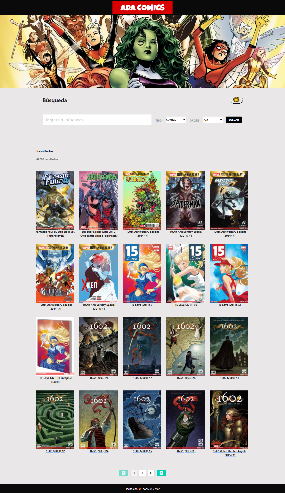

# ***Buscador de Comics by Silvi y Mari***

## Aplicación desarrollada para realizar búqueda de Comics y Personajes de comics, para tener la información de los mismos utilizando la API Rest de Marvel.
 

## Haciendo click [acá](https://maricaroj.github.io/buscador-comics/) podrás verlo andar y buscar tus comics favoritos! 🦸🏼‍♀️ 

### 📍***Este proyecto utiliza las siguientes dependencias:***

📁 [Marvel](https://www.marvel.com/signin?referer=https%3A%2F%2Fdeveloper.marvel.com%2)

📁 [Bootstrap](https://getbootstrap.com/)

📁 [Bulma](https://bulma.io/)

📁 [MD5](https://github.com/pvorb/node-md5#readme)

